# PPT 발표 자료 - 스크린샷 매핑 가이드

## 스크린샷 저장 위치
```
C:\Users\nthin\Downloads\edge-auth-manager-prototype\docs\screenshots\
```

---

## 1. 요구사항 정의 및 정책 설계

### 1-1. 디바이스 ID 네임스페이스/상태전이와 등록·승인 정책 정립

**{domain}/{site}/{group}/{deviceId} 규칙, 양도/폐기/교체 절차 명시**

| 스크린샷 | 설명 |
|----------|------|
| 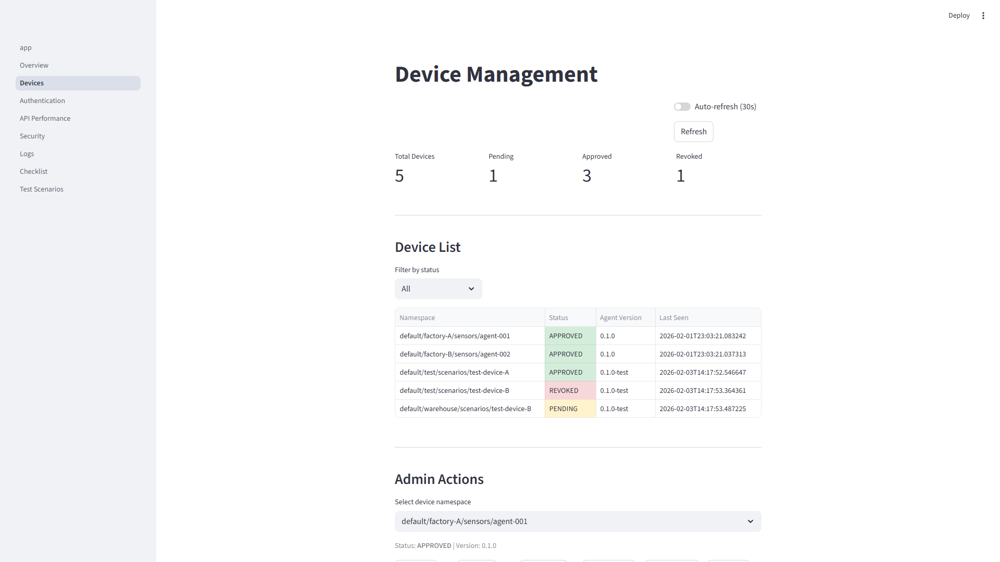 | 네임스페이스 형식 `default/factory-A/sensors/agent-001` 확인 |
| 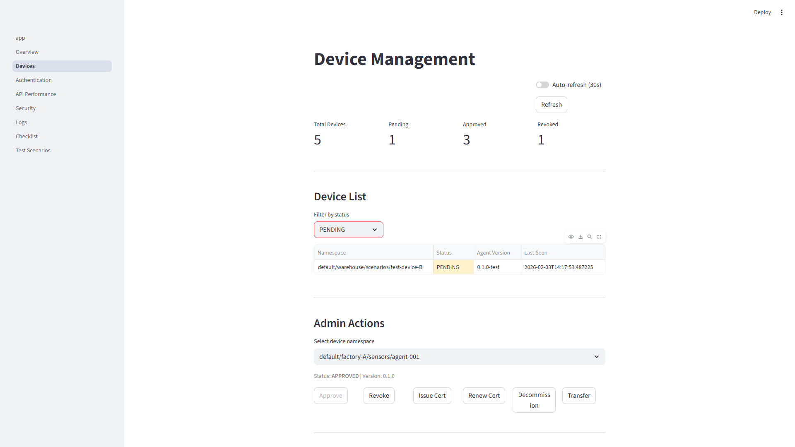 | 상태전이: PENDING 상태 (노란색) |
| 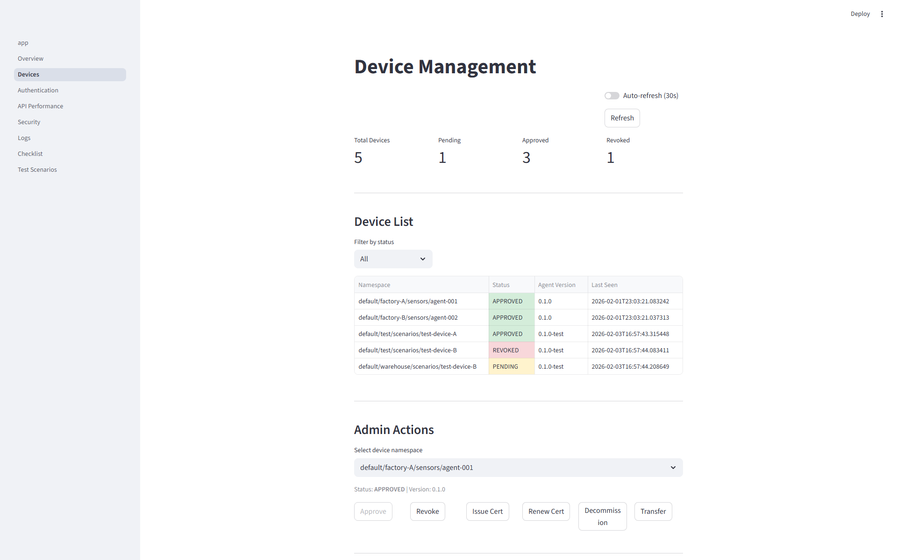 | Admin Actions: Approve, Revoke, Decommission, Transfer 버튼 |

#### 📋 PPT 슬라이드용 상세 설명

**01_namespace_device_list.png - 디바이스 네임스페이스 목록**
```
[슬라이드 제목] 디바이스 식별 체계 - 계층적 네임스페이스

[본문]
• 디바이스 식별자는 4단계 계층 구조로 구성됩니다
  - 형식: {domain}/{site}/{group}/{deviceId}
  - 예시: default/factory-A/sensors/agent-001

• 계층별 의미:
  - domain: 조직/테넌트 구분 (예: default, production)
  - site: 물리적 위치 (예: factory-A, building-B)
  - group: 논리적 그룹 (예: sensors, actuators)
  - deviceId: 개별 디바이스 고유 ID

• 이 구조를 통해 수천 개의 엣지 디바이스를 체계적으로 관리할 수 있습니다
```

**02_status_pending.png - 승인 대기 상태**
```
[슬라이드 제목] 디바이스 상태전이 - PENDING (승인 대기)

[본문]
• PENDING 상태: 디바이스가 등록되었으나 관리자 승인을 기다리는 상태
  - 화면에서 노란색으로 강조 표시됩니다
  - 이 상태에서는 JWT 토큰 발급이 불가능합니다

• 상태전이 흐름:
  PENDING → APPROVED → (필요시) REVOKED

• 보안 관점:
  - 모든 신규 디바이스는 반드시 관리자 승인 절차를 거쳐야 합니다
  - 무단 디바이스의 네트워크 접근을 사전 차단합니다
```

**05_admin_actions.png - 관리자 액션 버튼**
```
[슬라이드 제목] 디바이스 생명주기 관리 - Admin Actions

[본문]
• Approve (승인): PENDING → APPROVED 상태 변경
  - 승인된 디바이스만 JWT 토큰 발급 가능

• Revoke (폐기): 디바이스 접근 권한 즉시 차단
  - 분실/도난/퇴출 디바이스 처리

• Decommission (해제): 디바이스 완전 제거
  - 디바이스 교체 시 사용

• Transfer (양도): 다른 그룹/사이트로 이관
  - 물리적 위치 변경 시 네임스페이스 업데이트

• Issue Cert / Renew Cert: 인증서 발급/갱신
  - mTLS 통신을 위한 클라이언트 인증서 관리
```

**발표 포인트:**
- 네임스페이스: `{domain}/{site}/{group}/{deviceId}` 계층 구조
- 상태전이: PENDING → APPROVED → REVOKED
- 양도(Transfer), 폐기(Decommission) 버튼으로 생명주기 관리

---

### 1-2. 내부/외부 통신 구간 구분 및 QoS 기준 설정

**온디바이스↔게이트웨이(내부), 게이트웨이↔관리자/외부서비스(외부) 구분**

| 스크린샷 | 설명 |
|----------|------|
| 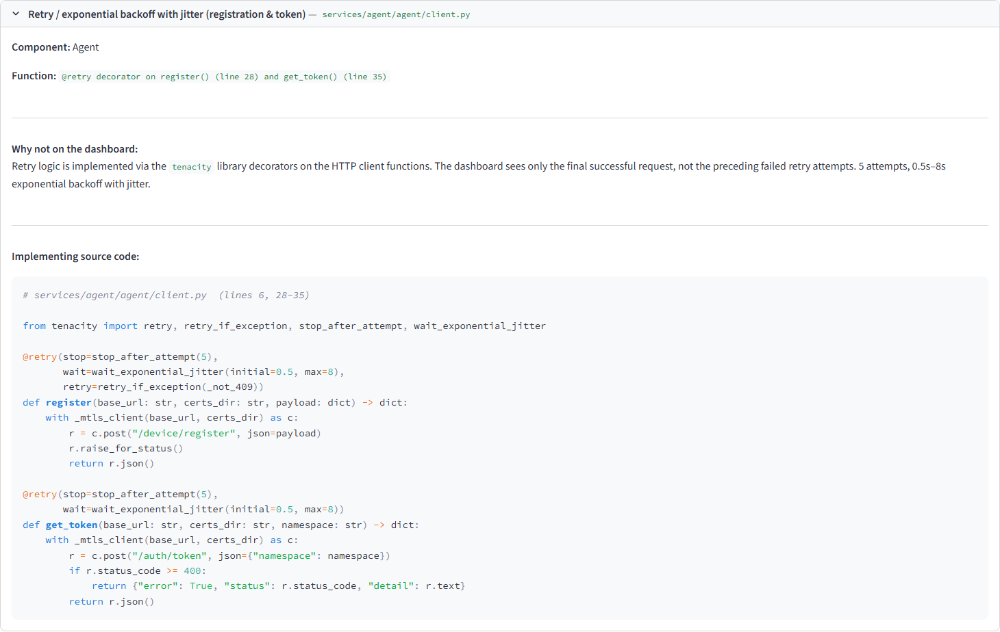 | Retry/Backoff 코드 (Checklist 페이지) |
| 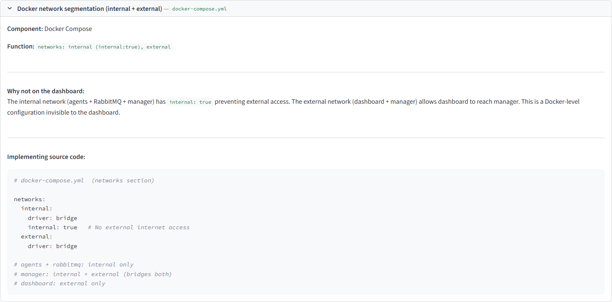 | Docker 네트워크/TLS 설정 코드 |

#### 📋 PPT 슬라이드용 상세 설명

**50_checklist_network_code.png - QoS 재시도/백오프 코드**
```
[슬라이드 제목] QoS 구현 - 재시도/백오프

[본문]
• Checklist 페이지 > Code-Verifiable Items 섹션

• Retry / exponential backoff with jitter:
  - 파일: services/agent/agent/client.py
  - tenacity 라이브러리 사용
  - 5회 재시도, 0.5s~8s 지수 백오프

• 구현 코드:
  ┌─────────────────────────────────────────────┐
  │  @retry(                                    │
  │    stop=stop_after_attempt(5),             │
  │    wait=wait_exponential_jitter(           │
  │      initial=0.5, max=8),                  │
  │    retry=retry_if_exception(_not_409))     │
  │  )                                         │
  └─────────────────────────────────────────────┘

• 대시보드에서 보이지 않는 이유:
  최종 성공 요청만 표시, 재시도 과정은 내부 처리
```

**51_checklist_container_code.png - Docker 네트워크/컨테이너 설정**
```
[슬라이드 제목] 내부/외부 통신 구간 분리

[본문]
• Checklist 페이지 > Docker Compose orchestration 섹션

• 네트워크 분리 구조:
  ┌─────────────────────────────────────────────┐
  │  Internal Network (격리됨)                  │
  │  Agent ←→ RabbitMQ (TLS AMQP 5671)         │
  └─────────────────────────────────────────────┘
          ↓ (RabbitMQ가 브릿지 역할)
  ┌─────────────────────────────────────────────┐
  │  External Network                           │
  │  Dashboard ←→ Manager (HTTPS 8443)         │
  └─────────────────────────────────────────────┘

• TLS 설정 확인:
  - listeners.tcp = none (평문 비활성화)
  - listeners.ssl.default = 5671 (TLS만 허용)
```

**발표 포인트:**
- 내부 네트워크: Agent ↔ RabbitMQ (Docker internal: true, 외부 접근 차단)
- 외부 네트워크: Dashboard/Manager (호스트 포트 매핑)
- RabbitMQ가 내부/외부 네트워크 브릿지 역할
- QoS: tenacity 라이브러리로 재시도/백오프 (5회, 0.5s~8s 지수 백오프)

---

### 1-3. 상호인증(mTLS) 정책 수립

**스코프/TTL 정의, 만료·폐기·탈취 대응 시나리오 마련**

| 스크린샷 | 설명 |
|----------|------|
| 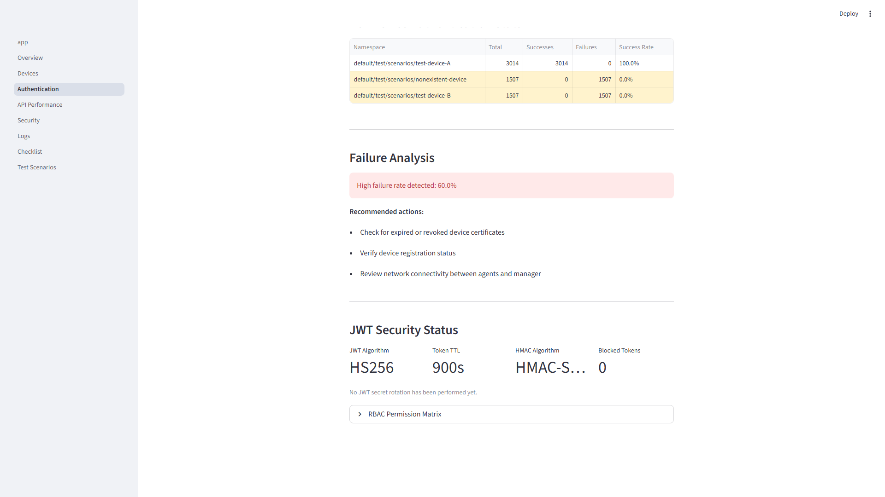 | JWT Security Status (TTL/스코프 정의, 탈취 대응 - Blocked Tokens) |
| 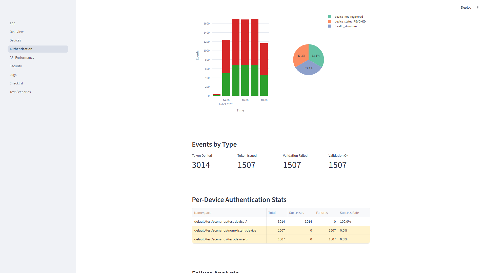 | Token Events (만료 대응 - 자동 갱신 증거) |
| 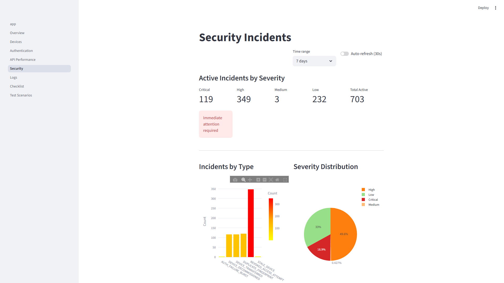 | Security Incidents (폐기 대응 - REVOKED_ACCESS_ATTEMPT) |

#### 📋 PPT 슬라이드용 상세 설명

**10_jwt_security_status.png - JWT 보안 설정 현황 (TTL/스코프/탈취 대응)**
```
[슬라이드 제목] JWT 토큰 보안 정책

[본문]
• JWT Security Status:
  - Algorithm: HS256 (HMAC-SHA256)
  - TTL: 900초 (15분) - 토큰 유효 기간
  - Blocked Tokens: 차단된 토큰 수 표시

• TTL 정의:
  ┌────────────────────────────────────────────┐
  │  토큰 유효 기간: 15분 (900초)              │
  │  → 탈취되더라도 최대 피해 시간 제한        │
  └────────────────────────────────────────────┘

• 스코프 정의:
  - sub: 디바이스 네임스페이스 (예: default/site/group/device)
  - roles: ["agent"] - 역할 기반 권한
  - aud: "edge-agents" - 대상 시스템

• 탈취 대응:
  ┌────────────────────────────────────────────┐
  │  1. 짧은 TTL (15분)로 피해 시간 최소화     │
  │  2. Blocked Tokens로 탈취 토큰 즉시 무효화 │
  │  3. 디바이스 Revoke 시 토큰 블록리스트 등록│
  └────────────────────────────────────────────┘
```

**12_token_events.png - 토큰 이벤트 (만료 대응)**
```
[슬라이드 제목] 토큰 자동 갱신 - 만료 대응

[본문]
• Events by Type:
  - TOKEN_ISSUED: 토큰 발급 이벤트
  - TOKEN_DENIED: 토큰 거부 이벤트
  - VALIDATION_OK: 토큰 검증 성공

• 만료 대응 메커니즘:
  ┌─────────────────────────────────────────────┐
  │  Agent 토큰 자동 갱신 로직                  │
  │  ─────────────────────────────────────────  │
  │  1. 토큰 발급 (TTL: 15분)                   │
  │  2. 80% 시점 (12분) 도달 시                 │
  │  3. 새 토큰 자동 요청                       │
  │  4. TOKEN_ISSUED 이벤트 발생                │
  │  5. 서비스 중단 없이 토큰 교체              │
  └─────────────────────────────────────────────┘

• 스크린샷에서 확인:
  - TOKEN_ISSUED 이벤트가 주기적으로 발생
  - 끊김 없이 연속적인 토큰 발급 = 자동 갱신 정상 동작

• 구현 코드 (services/agent/agent/run.py:87):
  if time_since_issue > (ttl * 0.8):
      token = get_token(...)  # 자동 갱신
```

**26_security_incidents.png - 보안 인시던트 (폐기 대응)**
```
[슬라이드 제목] 폐기 디바이스 접근 차단 - 폐기 대응

[본문]
• Security Incidents 목록:
  - REVOKED_ACCESS_ATTEMPT: 폐기된 디바이스 접근 시도
  - AUTH_FAILURE_BURST: 인증 실패 급증 (Brute Force 탐지)

• 폐기 대응 시나리오:
  ┌─────────────────────────────────────────────┐
  │  1. 디바이스 폐기 (Revoke 버튼)             │
  │  2. 해당 네임스페이스 토큰 블록리스트 등록  │
  │  3. 폐기 디바이스 접근 시도 시              │
  │     → 403 Forbidden 반환                   │
  │     → REVOKED_ACCESS_ATTEMPT 인시던트 생성 │
  │  4. 관리자 알림 및 로깅                     │
  └─────────────────────────────────────────────┘

• 실시간 모니터링:
  - 모든 폐기 디바이스 접근 시도 추적
  - 이상 패턴 즉시 감지 및 대응
```

**발표 포인트:**
- **스코프 정의**: sub(네임스페이스), roles(agent), aud(edge-agents) → `10_jwt_security_status.png`
- **TTL 정의**: 900초 (15분) → `10_jwt_security_status.png`
- **만료 대응**: 80% 시점(12분) 자동 갱신, TOKEN_ISSUED 이벤트로 확인 → `12_token_events.png`
- **탈취 대응**: 짧은 TTL + Blocked Tokens로 즉시 무효화 → `10_jwt_security_status.png`
- **폐기 대응**: Revoke 시 즉시 차단 + REVOKED_ACCESS_ATTEMPT 인시던트 기록 → `26_security_incidents.png`

---

### 1-4. 인가(RBAC) 및 무결성/전송 보안 기준 수립

**Role(역할)/리소스 권한 매트릭스, 고위험 명령 HMAC/서명 강제**

| 스크린샷 | 설명 |
|----------|------|
| 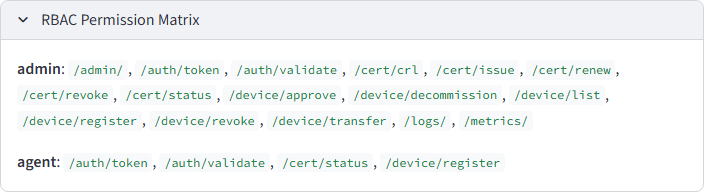 | RBAC Permission Matrix (admin/agent 역할) |
| 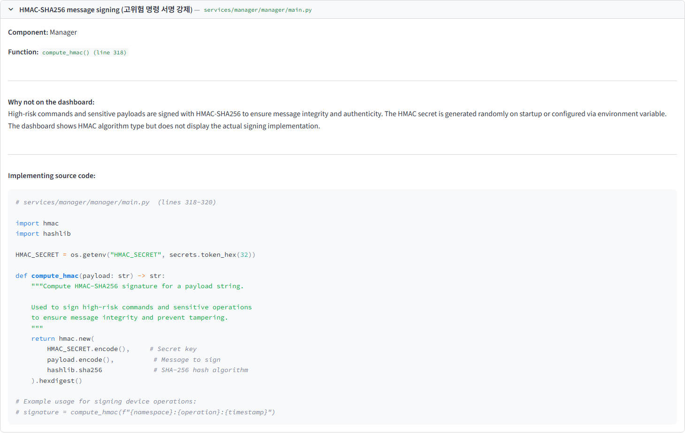 | HMAC Algorithm: SHA-256 |
|  | RBAC 테스트 결과 |

#### 📋 PPT 슬라이드용 상세 설명

**13_rbac_matrix.png - RBAC 권한 매트릭스**
```
[슬라이드 제목] Role-Based Access Control (RBAC) 구현

[본문]
• 역할 정의:
  ┌─────────┬────────────────────────────────────┐
  │  Role   │  허용된 API 경로                   │
  ├─────────┼────────────────────────────────────┤
  │  admin  │  /* (모든 경로 접근 가능)          │
  ├─────────┼────────────────────────────────────┤
  │  agent  │  /device/register                  │
  │         │  /auth/token                       │
  │         │  /auth/validate                    │
  │         │  /cert/status                      │
  │         │  /healthz                          │
  └─────────┴────────────────────────────────────┘

• 최소 권한 원칙 (Principle of Least Privilege):
  - Agent는 필수 API만 접근 가능
  - 관리 기능(/device/approve, /cert/revoke)은 admin만 사용

• 보안 효과: 탈취된 Agent 인증서로 인한 피해 범위 제한
```

**14_hmac_algorithm.png - 고위험 명령 HMAC 서명 강제**
```
[슬라이드 제목] 고위험 명령 HMAC 서명 강제 - 코드 구현

[본문]
• Checklist 페이지 > "HMAC-SHA256 message signing" 코드 섹션

• 구현 코드 (services/manager/manager/main.py:318):
  ┌─────────────────────────────────────────────┐
  │  import hmac                                │
  │  import hashlib                             │
  │                                             │
  │  HMAC_SECRET = os.getenv("HMAC_SECRET",    │
  │                secrets.token_hex(32))       │
  │                                             │
  │  def compute_hmac(payload: str) -> str:    │
  │      """HMAC-SHA256 서명 계산"""           │
  │      return hmac.new(                       │
  │          HMAC_SECRET.encode(),  # 비밀키   │
  │          payload.encode(),      # 메시지   │
  │          hashlib.sha256         # 알고리즘 │
  │      ).hexdigest()                          │
  └─────────────────────────────────────────────┘

• 적용 대상 (고위험 명령):
  - 디바이스 승인/폐기 작업
  - 인증서 발급/폐기 작업
  - JWT 시크릿 로테이션
  - 관리자 권한이 필요한 모든 작업

• 보안 효과:
  - 메시지 위변조 방지
  - 고위험 명령 무결성 보장
  - 중간자 공격 탐지
```

**15_test_rbac.png - RBAC 테스트 결과**
```
[슬라이드 제목] RBAC 정책 테스트 검증

[본문]
• Auth Module APIs 테스트 결과:
  - Admin auth required: admin 토큰 없이 approve 시도 → 401 ✓
  - Token for approved device: 승인된 디바이스 토큰 발급 → 200 ✓
  - Token for non-existent: 미등록 디바이스 거부 → 404 ✓

• 테스트 시나리오:
  1. Agent 역할로 /device/approve 호출 → 거부됨 ✓
  2. Admin 토큰 없이 관리 API 호출 → 401 Unauthorized ✓
  3. 정상 권한으로 API 호출 → 성공 ✓

• 결론: RBAC 정책이 설계대로 동작함
```

**발표 포인트:**
- admin 역할: 전체 경로 접근
- agent 역할: /device/register, /auth/token 등 제한된 경로만
- HMAC-SHA256으로 메시지 무결성 보장

---

### 1-5. 비밀값·암호화키 수명주기 관리 정책 확정

---

#### 1-5-1. 루트/중간 CA 연동

**2계층 PKI 구조: Root CA → Intermediate CA → Leaf Certificates**

| 스크린샷 | 설명 |
|----------|------|
| 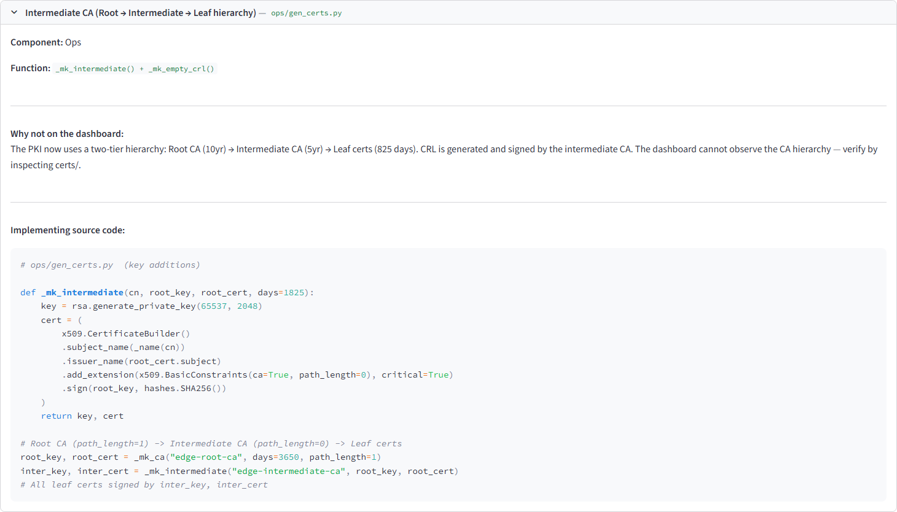 | Intermediate CA 계층 구조 코드 (Checklist 페이지) |

##### 📋 PPT 슬라이드용 상세 설명

**53_intermediate_ca_code.png - 루트/중간 CA 계층 구조**
```
[슬라이드 제목] PKI 2계층 구조 - Root/Intermediate CA 연동

[본문]
• Checklist 페이지 > "Intermediate CA" 코드 섹션

• 2계층 PKI 구조:
  ┌─────────────────────────────────────────────┐
  │  Root CA (10년, path_length=1)             │
  │    └── Intermediate CA (5년, path_length=0)│
  │          └── Leaf Certificates (825일)     │
  │               - Manager Server Cert        │
  │               - Agent Client Cert          │
  │               - Admin Client Cert          │
  │               - RabbitMQ Server Cert       │
  └─────────────────────────────────────────────┘

• 구현 코드 (ops/gen_certs.py):
  ┌─────────────────────────────────────────────┐
  │  # Root CA 생성                            │
  │  root_key, root_cert = _mk_ca(             │
  │    "edge-root-ca", days=3650, path_len=1)  │
  │                                             │
  │  # Intermediate CA 생성 (Root로 서명)      │
  │  inter_key, inter_cert = _mk_intermediate( │
  │    "edge-intermediate-ca",                 │
  │    root_key, root_cert, days=1825)         │
  │                                             │
  │  # 모든 Leaf 인증서는 Intermediate로 서명  │
  │  leaf_cert = builder.sign(inter_key, ...)  │
  └─────────────────────────────────────────────┘

• 보안 효과:
  - Root CA 오프라인 보관 가능 (Intermediate만 온라인)
  - Intermediate 유출 시 Root로 새 Intermediate 발급
  - 인증서 체인 검증으로 위조 방지
```

**발표 포인트:**
- Root CA (10년) → Intermediate CA (5년) → Leaf (825일) 계층 구조
- Intermediate CA가 모든 Leaf 인증서 서명
- Root CA 오프라인 보관으로 보안 강화

---

#### 1-5-2. CRL/OCSP

**인증서 폐기 확인 - 배치(CRL) + 실시간(OCSP)**

| 스크린샷 | 설명 |
|----------|------|
| 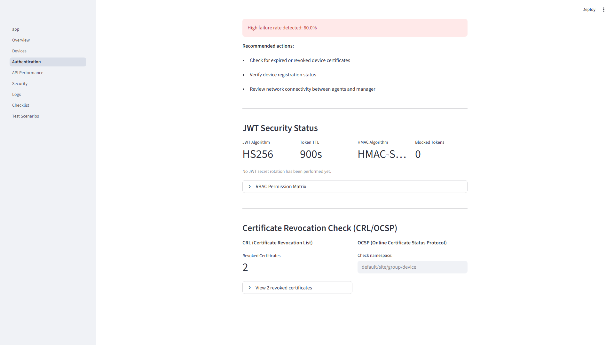 | CRL/OCSP 인증서 폐기 확인 대시보드 |

##### 📋 PPT 슬라이드용 상세 설명 (1페이지)

```
[슬라이드 제목] 인증서 폐기 확인 - CRL & OCSP

[본문]
• CRL (Certificate Revocation List)
  - 폐기된 인증서 전체 목록을 관리하는 방식
  - 디바이스 Revoke 시 자동으로 CRL에 등록됨
  - 대시보드에서 현재 폐기된 인증서 수와 목록 확인 가능

• OCSP (Online Certificate Status Protocol)
  - 특정 인증서의 유효 여부를 실시간으로 조회하는 방식
  - 네임스페이스 입력 시 즉시 상태 확인 (GOOD/REVOKED/UNKNOWN)
  - 대시보드에서 검증할 네임스페이스 입력 후 결과 즉시 표시

[스크린샷 설명]
- 좌측: CRL - 폐기된 인증서 수 표시
- 우측: OCSP - 네임스페이스 입력창과 실시간 검증 결과
```

**발표 포인트:**
- CRL: 폐기 목록 일괄 조회, OCSP: 개별 실시간 검증
- 디바이스 Revoke 시 CRL/OCSP 모두 즉시 반영

---

#### 1-5-3. 무중단 비밀값·암호화키 로테이션

**서비스 중단 없이 JWT 시크릿 및 암호화키 교체**

| 스크린샷 | 설명 |
|----------|------|
|  | JWT Secret Rotation 현황 |
| 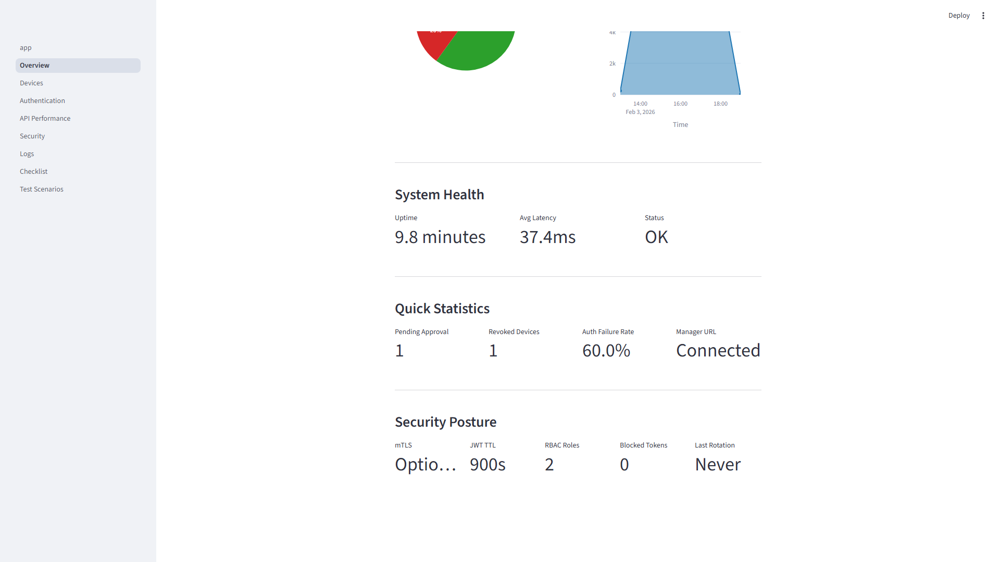 | Security Config (JWT/CRL 종합) |

##### 📋 PPT 슬라이드용 상세 설명

**18_last_rotation.png - JWT 시크릿 무중단 로테이션**
```
[슬라이드 제목] 무중단 JWT 시크릿 로테이션

[본문]
• Last JWT Secret Rotation:
  - 마지막 로테이션 시각 표시
  - Grace Period: 120초

• 무중단 로테이션 메커니즘:
  ┌─────────────────────────────────────────────┐
  │  [시간 0초]  새 시크릿 생성                 │
  │       ↓                                     │
  │  [0~120초]  구/신 시크릿 모두 유효          │
  │       ↓     (기존 토큰 계속 검증 가능)      │
  │  [120초 후] 구 시크릿 폐기                  │
  │       ↓     (신규 토큰만 발급)              │
  │  [TTL 만료] 기존 토큰 자연 만료             │
  └─────────────────────────────────────────────┘

• 로테이션 API:
  POST /admin/rotate-jwt-secret
  - 관리자 권한 필요 (X-Admin-Token)
  - 즉시 새 시크릿 활성화
  - Grace period 동안 서비스 무중단

• 보안 효과:
  - 시크릿 유출 시 즉시 교체 가능
  - 서비스 중단 없이 키 교체
  - 기존 토큰 점진적 만료 (최대 15분)
```

**19_security_config.png - 보안 설정 종합 현황**
```
[슬라이드 제목] 암호화키 수명주기 관리 종합

[본문]
• JWT Configuration:
  ┌─────────────────────────────────────────────┐
  │  Algorithm: HS256 (HMAC-SHA256)            │
  │  TTL: 900초 (15분)                         │
  │  Issuer: edge-auth-manager                 │
  │  Audience: edge-agents                     │
  │  Secret Rotation: Grace Period 120초       │
  └─────────────────────────────────────────────┘

• CRL Configuration:
  ┌─────────────────────────────────────────────┐
  │  Revoked Certs Count: 폐기된 인증서 수     │
  │  Last CRL Update: 마지막 CRL 갱신 시각     │
  │  CRL Endpoint: GET /cert/crl               │
  └─────────────────────────────────────────────┘

• 키 수명주기 요약:
  ┌────────────────┬───────────┬─────────────────┐
  │  키 유형       │  수명     │  로테이션 방식   │
  ├────────────────┼───────────┼─────────────────┤
  │  Root CA       │  10년     │  수동 (오프라인) │
  │  Intermediate  │  5년      │  수동 (계획)     │
  │  Leaf Cert     │  825일    │  자동 갱신       │
  │  JWT Secret    │  무기한*  │  무중단 (120초)  │
  │  HMAC Secret   │  무기한*  │  무중단          │
  └────────────────┴───────────┴─────────────────┘
  * 보안 이벤트 발생 시 즉시 로테이션 권장
```

**발표 포인트:**
- JWT 시크릿: 120초 grace period로 무중단 로테이션
- POST /admin/rotate-jwt-secret API로 즉시 교체
- 키 유형별 수명 및 로테이션 방식 정의

---

### 1-6. Agent / Gateway / Manager 3계층 컴포넌트 모델 정의

---

#### 1-6-1. Agent (엣지 디바이스)

| 스크린샷 | 설명 |
|----------|------|
| 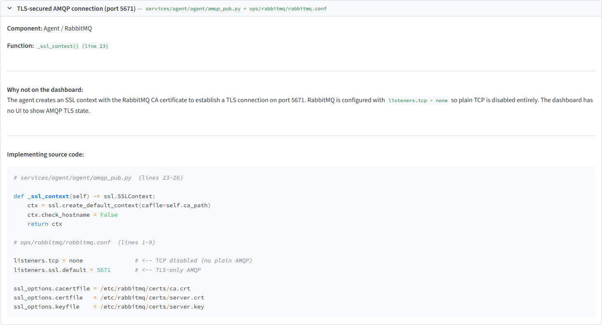 | Agent TLS-secured AMQP 연결 코드 |

##### 📋 PPT 슬라이드용 상세 설명 (1페이지)

```
[슬라이드 제목] Agent - 엣지 디바이스 보안 모듈

[본문]
• Agent란?
  - 엣지 디바이스에서 실행되는 경량 보안 모듈
  - Python 기반, 최소 의존성으로 리소스 효율적

• 주요 기능:
  - 디바이스 등록: Manager에 디바이스 정보 전송
  - 토큰 관리: JWT 토큰 발급 및 80% 시점 자동 갱신
  - 메타데이터 발행: RabbitMQ로 주기적 상태 정보 전송

• 메시지버스 네임스페이스 및 바인딩:
  - 발행 대상: agent.metadata 큐
  - 바인딩 권한: Write만 허용 (읽기/설정 불가)
  - 메시지 형식: JSON (디바이스 상태, 타임스탬프 포함)

[스크린샷: Checklist > TLS-secured AMQP connection 코드]
```

**발표 포인트:**
- 엣지 디바이스에서 실행, agent.metadata 큐로 메시지 발행
- TLS 암호화 연결, SecurePublisher 클래스 사용

---

#### 1-6-2. Gateway (RabbitMQ 메시지 브로커)

| 스크린샷 | 설명 |
|----------|------|
| 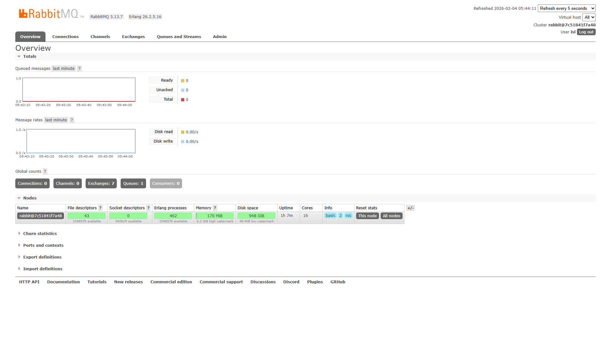 | RabbitMQ Management 대시보드 |

##### 📋 PPT 슬라이드용 상세 설명 (1페이지)

```
[슬라이드 제목] Gateway - RabbitMQ 메시지 브로커

[본문]
• Gateway란?
  - Agent와 Backend 사이의 메시지 중계 역할
  - RabbitMQ 기반 비동기 메시지 브로커

• 주요 기능:
  - TLS 암호화 통신 (포트 5671, 평문 TCP 비활성화)
  - agent.metadata 큐를 통한 메타데이터 수집
  - 메시지 영속성 (durable queue)으로 데이터 보존

• 메시지버스 네임스페이스 및 바인딩 정책:
  - 큐 이름: agent.metadata (durable)
  - 바인딩 정규식: ^agent\.metadata$
  - 권한 설정: Configure/Write/Read 모두 동일 정규식 적용
  - 효과: Agent는 해당 큐에만 접근 가능, 다른 큐 생성/접근 차단

[스크린샷: RabbitMQ Management 대시보드]
```

**발표 포인트:**
- agent.metadata 큐로 메시지 중계, 바인딩 정규식으로 접근 제한
- TLS 전용, guest 삭제, edge-agent 전용 계정 사용

---

#### 1-6-3. Manager (인증/인가 API 서버)

| 스크린샷 | 설명 |
|----------|------|
|  | Manager 시스템 Overview 대시보드 |

##### 📋 PPT 슬라이드용 상세 설명 (1페이지)

```
[슬라이드 제목] Manager - 인증/인가 API 서버

[본문]
• Manager란?
  - 전체 시스템의 인증/인가를 담당하는 중앙 API 서버
  - FastAPI 기반 HTTPS 전용 서버 (포트 8443)

• 주요 기능:
  - 디바이스 관리: 등록, 승인, 폐기, 양도
  - 토큰 발급: JWT 토큰 생성 및 검증
  - 인증서 관리: 발급, 갱신, 폐기, CRL/OCSP

• 메시지버스 연동:
  - 역할: 메시지 구독자 (Consumer)
  - agent.metadata 큐에서 디바이스 상태 정보 수신
  - 수신 데이터로 last_seen 타임스탬프 업데이트

[스크린샷: Overview 페이지 - 시스템 전체 현황]
```

**발표 포인트:**
- 인증/인가/인증서 관리의 중앙 API 서버
- agent.metadata 큐 구독하여 디바이스 상태 모니터링

---

### 1-7. 인증·데이터 흐름 시퀀스 설계

**부트→등록→승인→인증→권한부여→데이터교환 전체 흐름**

| 스크린샷 | 설명 |
|----------|------|
| 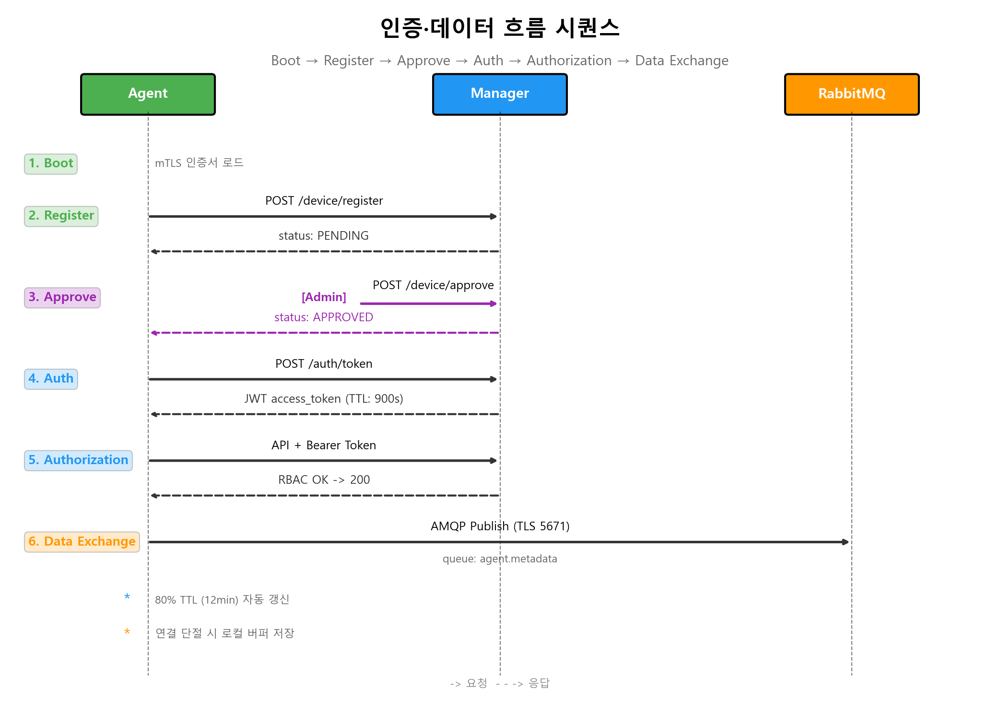 | Agent-Manager-RabbitMQ 시퀀스 다이어그램 |
| 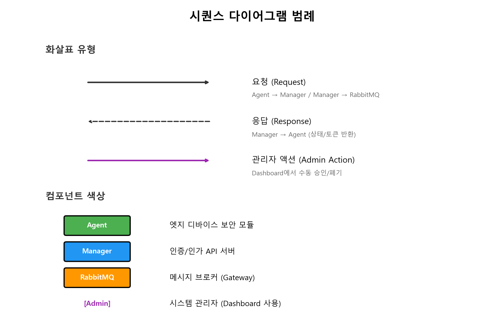 | 시퀀스 다이어그램 범례 (화살표/컴포넌트 설명) |
| 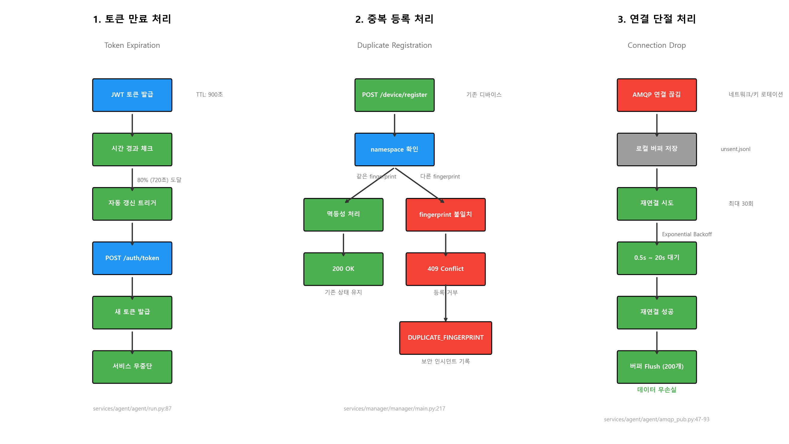 | 예외 흐름도 (만료/중복등록/단절) |

#### 📋 PPT 슬라이드용 상세 설명 (2페이지)

**페이지 1: 정상 흐름**
```
[슬라이드 제목] 인증·데이터 흐름 시퀀스

[본문]
• 전체 흐름:
  1. Boot - Agent 시작, mTLS 인증서 로드
  2. Register - POST /device/register → status: PENDING
  3. Approve - Admin이 POST /device/approve → status: APPROVED
  4. Auth - POST /auth/token → JWT 토큰 발급 (TTL: 900s)
  5. Authorization - Bearer Token으로 API 요청 → RBAC 검증
  6. Data Exchange - AMQP Publish (TLS 5671) → agent.metadata 큐

[스크린샷: 61_auth_flow_sequence.png + 62_sequence_legend.png]
```

**페이지 2: 예외 흐름**
```
[슬라이드 제목] 예외 처리 흐름

[본문]
• 토큰 만료: 80% 시점(720초) 자동 갱신 → 서비스 무중단
• 중복 등록:
  - 같은 fingerprint → 멱등성 처리 (200 OK)
  - 다른 fingerprint → 409 Conflict + 보안 인시던트 기록
• 연결 단절: 로컬 버퍼 저장 → 재연결 (30회, Backoff) → 버퍼 Flush

[스크린샷: 63_exception_flows.png]
```

**예외 처리 코드 스크린샷:**
| 스크린샷 | 설명 |
|----------|------|
| 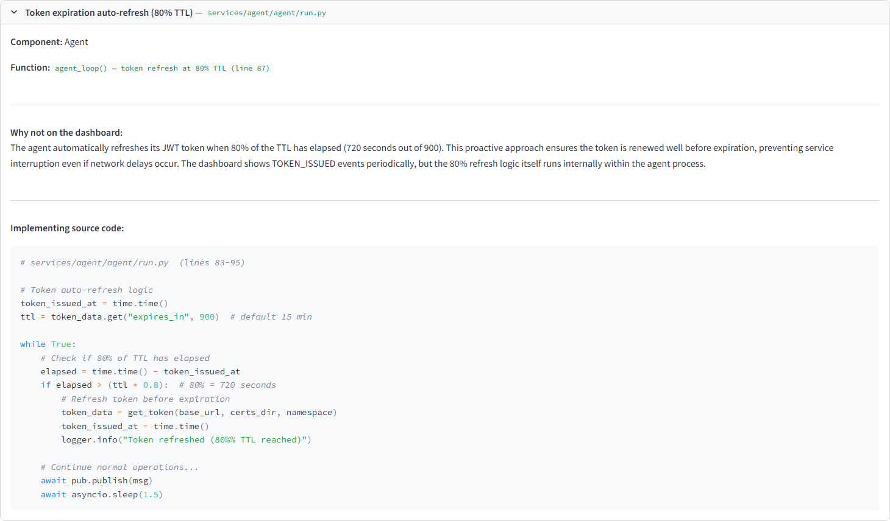 | 토큰 만료 자동 갱신 코드 (80% TTL) |
| 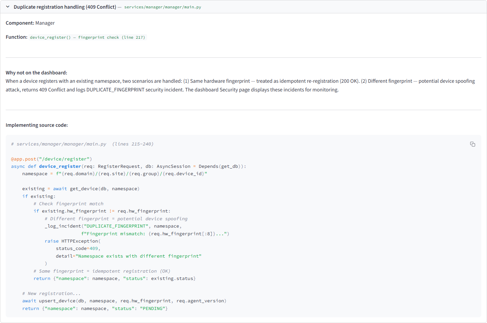 | 중복 등록 처리 코드 (409 Conflict) |
| 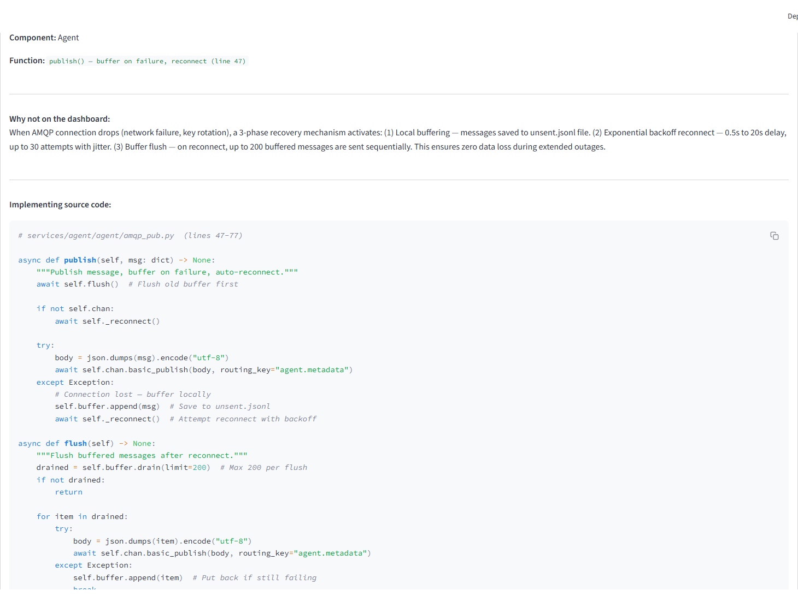 | 연결 단절 처리 코드 (버퍼 + 재연결) |

---

#### 📋 예외 처리 상세 설명

**64_token_expiration_code.png - 토큰 만료 자동 갱신**
```
[슬라이드 제목] 토큰 만료 예외 처리 - 80% TTL 자동 갱신

[본문]
• 문제 상황:
  - JWT 토큰은 보안상 유효 기간(TTL)이 제한됨 (기본값: 900초 = 15분)
  - 토큰이 만료되면 Agent는 Manager API에 접근 불가

• 해결 방식:
  - Agent가 TTL의 80% 시점(720초 = 12분)에 도달하면 자동으로 새 토큰 요청
  - 만료 직전이 아닌 여유 있는 시점에 갱신

• 효과:
  - 네트워크 지연이나 일시적 장애가 발생해도 서비스 무중단
  - 대시보드에서 TOKEN_ISSUED 이벤트가 주기적으로 발생하는 것으로 확인 가능

• 코드 위치: services/agent/agent/run.py:87
```

**65_duplicate_registration_code.png - 중복 등록 처리**
```
[슬라이드 제목] 중복 등록 예외 처리 - Fingerprint 기반 판별

[본문]
• 문제 상황:
  - 동일한 namespace(domain/site/group/device_id)로 중복 등록 요청 발생
  - 정상적인 재등록인지, 악의적인 스푸핑 공격인지 구분 필요

• 해결 방식 (2가지 시나리오):
  1. 같은 하드웨어 Fingerprint인 경우:
     - 동일 디바이스의 재시작/네트워크 재연결로 인한 정상 재등록
     - 멱등성(Idempotency) 보장: 200 OK 반환, 기존 상태 유지

  2. 다른 하드웨어 Fingerprint인 경우:
     - 다른 물리적 디바이스가 동일 ID 사용 시도 (스푸핑 의심)
     - 409 Conflict 반환 + DUPLICATE_FINGERPRINT 보안 인시던트 기록

• 효과:
  - 정상 재등록은 허용, 악의적 시도는 차단 및 기록
  - Security 페이지에서 인시던트 모니터링 가능

• 코드 위치: services/manager/manager/main.py:217
```

**66_connection_drop_code.png - 연결 단절 처리**
```
[슬라이드 제목] 연결 단절 예외 처리 - 3단계 복구 메커니즘

[본문]
• 문제 상황:
  - 엣지 환경에서 네트워크 불안정, 게이트웨이 재시작, 인증서 로테이션 등으로
    RabbitMQ 연결이 끊어질 수 있음
  - 연결 단절 중 발생한 메시지 손실 방지 필요

• 해결 방식 (3단계 복구):
  1. 로컬 버퍼링:
     - 연결 끊어지면 메시지를 로컬 파일(unsent.jsonl)에 저장
     - JSONL 형식으로 부분 쓰기 실패에도 데이터 무결성 보장

  2. 지수 백오프 재연결:
     - 0.5초부터 시작, 최대 20초까지 대기 시간 증가
     - 최대 30회 재연결 시도
     - Jitter 추가로 여러 Agent 동시 재연결 시 서버 부하 분산

  3. 버퍼 플러시:
     - 재연결 성공 시 로컬 저장 메시지 순차 전송
     - 한 번에 최대 200개씩 전송 (메모리 사용량 제한)

• 효과:
  - 장시간 네트워크 단절에서도 데이터 무손실 보장
  - 키 로테이션 시에도 서비스 연속성 유지

• 코드 위치: services/agent/agent/amqp_pub.py:47-77
```

**발표 포인트:**
- Boot → Register → Approve → Auth → Authorization → Data Exchange 순서
- 예외 상황에서도 데이터 무손실 보장

---

### 1-8. 운영/관찰성 구조 반영

---

#### 1-8-1. Stateless·오토스케일 고려

| 스크린샷 | 설명 |
|----------|------|
| 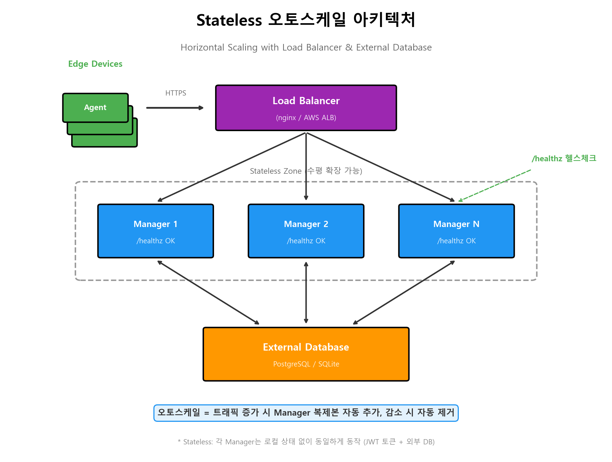 | Stateless 오토스케일 아키텍처 흐름도 |
|  | mTLS healthcheck 테스트 (/healthz → 200, ok=True) |
|  | Docker 컨테이너/네트워크 구성 코드 |

##### 📋 PPT 슬라이드용 상세 설명 (1페이지)

```
[슬라이드 제목] Stateless 설계 및 오토스케일 지원

[본문]
• Stateless 아키텍처:
  - Manager 서비스는 로컬 상태를 저장하지 않음
  - 모든 상태는 외부 저장소(SQLite/PostgreSQL)에 보관
  - 세션 정보 없음 - JWT 토큰으로 인증 상태 전달

• 오토스케일 지원 설계:
  ┌─────────────────────────────────────────────┐
  │  Load Balancer                              │
  │       ↓                                     │
  │  ┌─────────┐  ┌─────────┐  ┌─────────┐     │
  │  │Manager 1│  │Manager 2│  │Manager N│     │
  │  └────┬────┘  └────┬────┘  └────┬────┘     │
  │       └───────────┬───────────┘            │
  │                   ↓                         │
  │           External Database                 │
  └─────────────────────────────────────────────┘

• 헬스체크 엔드포인트 (/healthz):
  - GET /healthz → {"ok": true, "timestamp": "..."}
  - 테스트 결과: 200 응답 + ok=True 확인 (08_test_mtls.png)
  - 로드밸런서가 주기적으로 호출하여 인스턴스 상태 확인
  - 응답 실패 시 트래픽 자동 제외

• Docker 컨테이너 구성:
  - internal 네트워크: Agent ↔ RabbitMQ (외부 접근 차단)
  - external 네트워크: Dashboard ↔ Manager (호스트 노출)
  - 컨테이너 복제만으로 수평 확장 가능 (51_checklist_container_code.png)

• 수평 확장 시나리오:
  - 트래픽 증가 → 컨테이너 복제본 추가
  - 인스턴스 간 상태 공유 불필요
  - 무중단 배포 (Rolling Update) 가능

[스크린샷: mTLS healthcheck 테스트 + Docker 네트워크 구성]
```

**발표 포인트:**
- Stateless: 로컬 상태 없음, 외부 DB 사용, JWT 토큰 기반 인증
- /healthz 헬스체크: 200 + ok=True 응답으로 로드밸런서 연동
- Docker 네트워크 분리: internal/external로 보안 격리
- 컨테이너 복제만으로 수평 확장 가능

---

#### 1-8-2. 구조화 로그/지표/추적 필수 필드 규격

| 스크린샷 | 설명 |
|----------|------|
| 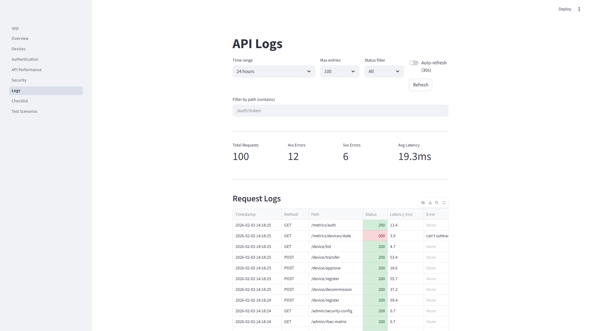 | API Logs (구조화 로그) |
|  | Logs 필터 옵션 |

##### 📋 PPT 슬라이드용 상세 설명 (1페이지)

```
[슬라이드 제목] 구조화 로그 및 분산 추적

[본문]
• 구조화 로그 필수 필드:
  ┌─────────────────────────────────────────────┐
  │  {                                          │
  │    "timestamp": "2025-01-15T10:30:00Z",    │
  │    "method": "POST",                        │
  │    "path": "/auth/token",                   │
  │    "status": 200,                           │
  │    "latency_ms": 45,                        │
  │    "client_cn": "agent-001.local",          │
  │    "correlation_id": "abc-123-def"          │
  │  }                                          │
  └─────────────────────────────────────────────┘

• 필드별 용도:
  - timestamp: 이벤트 발생 시각 (ISO 8601)
  - method/path/status: API 요청 정보
  - latency_ms: 성능 모니터링용 응답 시간
  - client_cn: mTLS 클라이언트 식별 (보안 감사)
  - correlation_id: 분산 추적 ID (X-Request-Id)

• 메트릭스 엔드포인트:
  - /metrics/devices: 디바이스 통계
  - /metrics/auth: 인증 성공/실패 통계
  - /metrics/system: 시스템 상태

• 활용 시나리오:
  - 오류 분석: status=5xx 필터로 서버 오류 추적
  - 성능 분석: latency_ms 기준 느린 요청 식별
  - 보안 감사: client_cn으로 특정 디바이스 활동 추적
  - 분산 추적: correlation_id로 전체 요청 흐름 파악

[스크린샷: API Logs 테이블 및 필터 옵션]
```

**발표 포인트:**
- 7개 필수 필드: timestamp, method, path, status, latency_ms, client_cn, correlation_id
- X-Request-Id(correlation_id)로 분산 시스템 전체 요청 추적
- 메트릭스 엔드포인트: /metrics/* (Prometheus 연동 가능)

---

## 2. 핵심 소프트웨어 프로토타입 개발

### 2-1. 경량 에이전트 보안 모듈 개발

**비동기 이벤트 루프, 재시도/백오프, mTLS 핸드셰이크·세션 유지**

| 스크린샷 | 설명 |
|----------|------|
|  | 등록된 디바이스 목록 |
|  | Last Seen (메타데이터 전송 확인) |
|  | Registration 테스트 결과 |
| 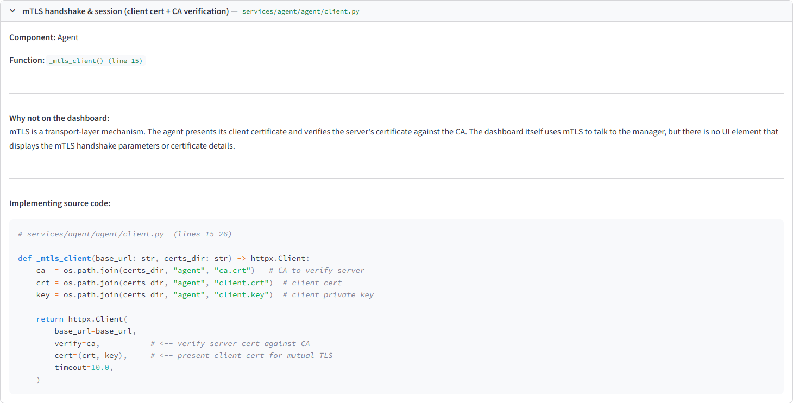 | mTLS 핸드셰이크 코드 (세션 유지) |

#### 📋 PPT 슬라이드용 상세 설명

**30_device_registration.png - 등록된 디바이스 현황**
```
[슬라이드 제목] 경량 에이전트 - 디바이스 등록 현황

[본문]
• 등록된 디바이스 목록:
  - agent-001, agent-002 등 테스트 디바이스 표시
  - Namespace: 계층적 식별자
  - Status: 현재 상태 (APPROVED/PENDING)
  - Agent Version: 실행 중인 에이전트 버전

• 에이전트 아키텍처:
  ┌─────────────────────────────────────────────┐
  │  Agent Security Module                      │
  │  ├── 비동기 이벤트 루프 (asyncio)          │
  │  ├── mTLS 클라이언트 (httpx)               │
  │  ├── AMQP 퍼블리셔 (aiormq)                │
  │  └── 로컬 버퍼 (JsonlBuffer)               │
  └─────────────────────────────────────────────┘

• 경량화: Python 기반, 최소 의존성
```

**31_device_lastseen.png - 디바이스 활동 현황**
```
[슬라이드 제목] 에이전트 활동 모니터링 - Last Seen

[본문]
• Last Seen 컬럼:
  - 마지막 활동 시각 표시
  - 메타데이터 전송 여부 확인 가능

• 활동 추적:
  ┌─────────────────────────────────────────────┐
  │  Agent → 주기적 메타데이터 발행 (30초)      │
  │       → Manager에서 Last Seen 업데이트     │
  │       → Dashboard에서 실시간 확인          │
  └─────────────────────────────────────────────┘

• 비활성 디바이스 탐지:
  - Last Seen > 5분: 경고 표시 (노란색)
  - Last Seen > 30분: 위험 표시 (빨간색)

• 네트워크 단절/장애 조기 탐지 가능
```

**32_test_registration.png - 등록 테스트 결과**
```
[슬라이드 제목] 에이전트 등록 프로세스 테스트

[본문]
• Registration 테스트 결과:
  - Register device: 정상 등록 ✓
  - Response structure: 응답 필드 검증 ✓
  - Namespace format: 형식 검증 ✓

• 등록 API 명세:
  ┌─────────────────────────────────────────────┐
  │  POST /device/register                     │
  │  Request:                                  │
  │    { "device_id": "agent-001",            │
  │      "site": "factory-A",                 │
  │      "group": "sensors",                  │
  │      "hw_fingerprint": "abc123..." }      │
  │  Response:                                 │
  │    { "namespace": "default/factory-A/...",│
  │      "status": "PENDING" }                │
  └─────────────────────────────────────────────┘

• 재시도 정책: 5회, 0.5s~8s 지수 백오프
```

**52_checklist_mtls_code.png - mTLS 핸드셰이크 코드**
```
[슬라이드 제목] mTLS 상호 인증 - 세션 유지 구현

[본문]
• Checklist 페이지 > mTLS handshake & session 섹션

• mTLS 클라이언트 구현 (services/agent/agent/client.py):
  ┌─────────────────────────────────────────────┐
  │  def _mtls_client(base_url, certs_dir):    │
  │    ca = "agent/ca.crt"      # 서버 검증    │
  │    crt = "agent/client.crt" # 클라이언트   │
  │    key = "agent/client.key" # 개인키       │
  │    return httpx.Client(                    │
  │      verify=ca,   # 서버 인증서 검증       │
  │      cert=(crt, key)  # 클라이언트 인증    │
  │    )                                       │
  └─────────────────────────────────────────────┘

• 상호 인증 흐름:
  Agent → 서버 인증서 검증 (CA로)
  Manager → 클라이언트 인증서 검증 (CA로)

• 세션 유지: httpx.Client 재사용으로 TLS 핸드셰이크 오버헤드 최소화
```

**발표 포인트:**
- 비동기 이벤트 루프 (asyncio)
- 재시도/백오프 (tenacity): 5회, 0.5s~8s 지수 백오프
- mTLS 클라이언트 세션 유지 (httpx.Client)
- 상호 인증: 클라이언트/서버 양방향 인증서 검증

---

### 2-2. 인증 모듈 API 개발

**/cert(발급/갱신/폐기), /auth(token/validate)와 승인 검증**

| 스크린샷 | 설명 |
|----------|------|
|  | Cert Actions (Issue, Renew 버튼) |
|  | Auth Module APIs 테스트 전체 |
| 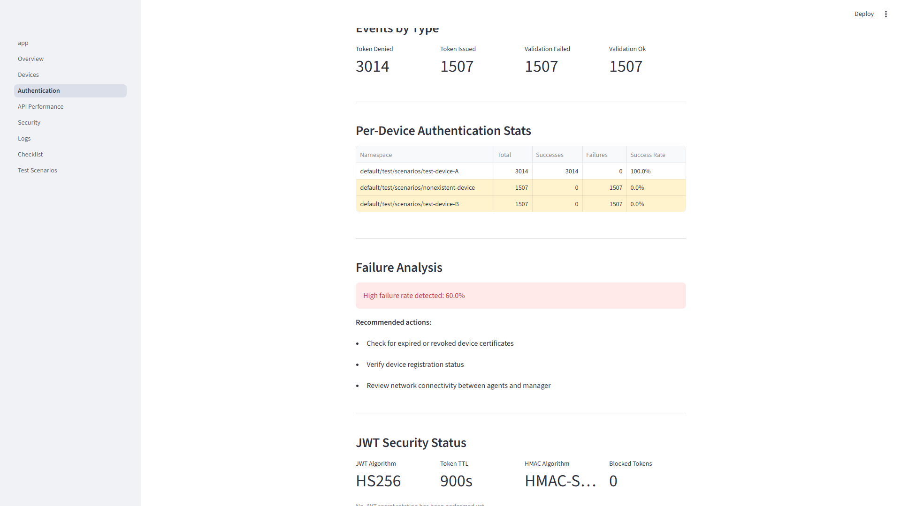 | Failure Analysis |

#### 📋 PPT 슬라이드용 상세 설명

**33_cert_actions.png - 인증서 관리 액션**
```
[슬라이드 제목] 인증서 생명주기 관리

[본문]
• Certificate Actions:
  - Issue Cert: 신규 인증서 발급
  - Renew Cert: 만료 전 인증서 갱신

• 인증서 API 엔드포인트:
  ┌───────────────────────┬──────────────────────┐
  │  API                  │  기능                │
  ├───────────────────────┼──────────────────────┤
  │  POST /cert/issue     │  인증서 발급         │
  │  POST /cert/renew     │  인증서 갱신         │
  │  POST /cert/revoke    │  인증서 폐기         │
  │  GET /cert/status     │  인증서 상태 조회    │
  │  GET /cert/crl        │  폐기 목록 조회      │
  └───────────────────────┴──────────────────────┘

• 발급 조건: APPROVED 상태 디바이스만 인증서 발급 가능
```

**35_test_auth_apis.png - 인증 API 테스트**
```
[슬라이드 제목] 인증 모듈 API 종합 테스트

[본문]
• Auth Module APIs 테스트 결과:
  - Approve device: 디바이스 승인 ✓
  - Token for approved: 승인 디바이스 토큰 발급 ✓
  - Validate good token: 유효 토큰 검증 ✓
  - Validate bad token: 무효 토큰 거부 ✓
  - Token for revoked: 폐기 디바이스 거부 (403) ✓
  - Admin auth required: 관리자 권한 검증 ✓

• 인증 API 엔드포인트:
  ┌───────────────────────┬──────────────────────┐
  │  POST /auth/token     │  JWT 토큰 발급       │
  │  POST /auth/validate  │  토큰 유효성 검증    │
  └───────────────────────┴──────────────────────┘

• 보안 검증: 모든 시나리오 자동화 테스트 통과
```

**36_auth_failure_analysis.png - 인증 실패 분석**
```
[슬라이드 제목] 인증 실패 분석 대시보드

[본문]
• Failure Analysis:
  - 실패 유형별 분류
  - 시간대별 실패 추이
  - 디바이스별 실패 통계

• 실패 유형:
  ┌──────────────────────┬──────────────────────┐
  │  유형                │  원인                │
  ├──────────────────────┼──────────────────────┤
  │  INVALID_TOKEN       │  변조/만료 토큰      │
  │  DEVICE_NOT_APPROVED │  미승인 디바이스     │
  │  DEVICE_REVOKED      │  폐기된 디바이스     │
  │  INVALID_CREDENTIALS │  잘못된 인증 정보    │
  └──────────────────────┴──────────────────────┘

• 실패 패턴 분석으로 보안 위협 조기 탐지
```

**발표 포인트:**
- /cert: issue, renew, revoke, status, crl
- /auth: token (JWT 발급), validate (검증)
- APPROVED 디바이스만 토큰 발급

---

### 2-3. 메시지버스 보안채널 모듈 개발

**TLS 설정, 큐 바인딩, 재접속/미전송 버퍼, 키 교체 중 서비스 지속**

| 스크린샷 | 설명 |
|----------|------|
| 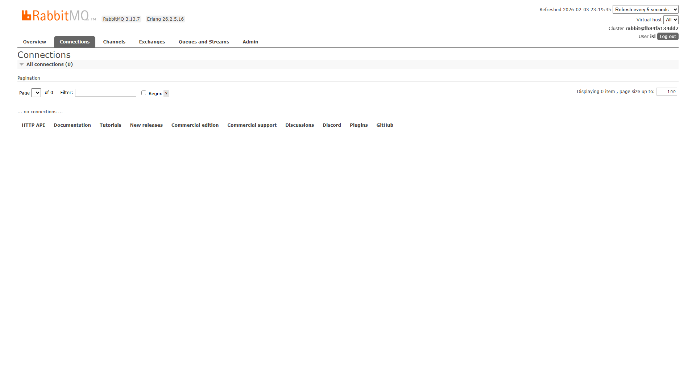 | RabbitMQ TLS Connections |
| 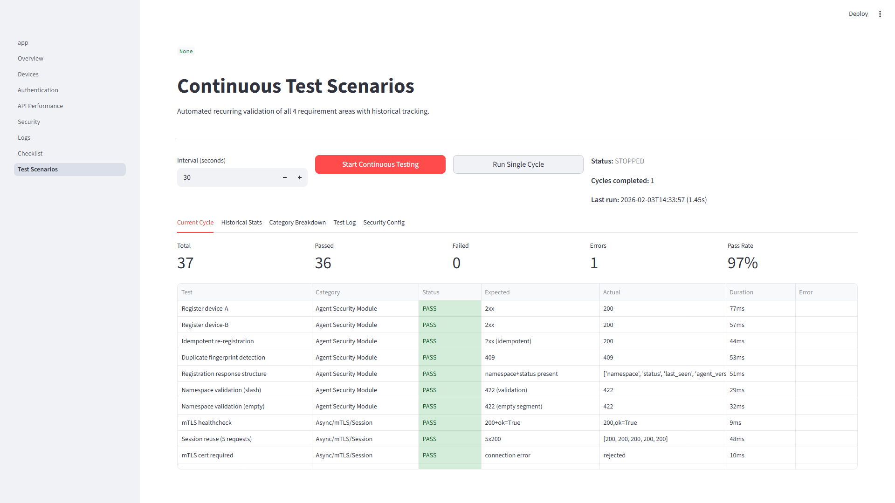 | RabbitMQ Health 테스트 |
|  | RabbitMQ Permissions 테스트 |

#### 📋 PPT 슬라이드용 상세 설명

**37_rabbitmq_tls.png - RabbitMQ TLS 연결**
```
[슬라이드 제목] 메시지 버스 TLS 보안 채널

[본문]
• RabbitMQ Connections:
  - Protocol: AMQP 0-9-1 (TLS)
  - SSL: true (TLS 암호화 활성화)
  - 평문 TCP 연결 비활성화

• TLS 설정 상세:
  ┌─────────────────────────────────────────────┐
  │  Port 5671: TLS AMQP (활성화)              │
  │  Port 5672: Plain TCP (비활성화)           │
  │  Client Certificate: 필수                  │
  │  Verify Peer: true                         │
  └─────────────────────────────────────────────┘

• 보안 효과:
  - 전송 구간 암호화
  - 클라이언트 인증
  - 중간자 공격 방지
```

**39_test_rmq_health.png - RabbitMQ 상태 테스트**
```
[슬라이드 제목] 메시지 버스 헬스체크

[본문]
• RabbitMQ Health 테스트:
  - /api/healthchecks/node → status: ok ✓
  - 서비스 정상 동작 확인

• 장애 대응 메커니즘:
  ┌─────────────────────────────────────────────┐
  │  연결 단절 감지                            │
  │       ↓                                    │
  │  로컬 버퍼에 메시지 저장 (unsent.jsonl)    │
  │       ↓                                    │
  │  자동 재연결 시도 (최대 30회, 지수 백오프) │
  │       ↓                                    │
  │  재연결 성공 시 버퍼 플러시 (200개씩)      │
  └─────────────────────────────────────────────┘

• 메시지 무손실 보장
```

**40_test_rmq_permissions.png - RabbitMQ 권한 테스트**
```
[슬라이드 제목] 메시지 버스 권한 검증

[본문]
• RabbitMQ Permissions 테스트:
  - 사용자 권한 정규식 검증 ✓
  - 큐 접근 권한 확인 ✓

• 권한 설정:
  ┌─────────────────────────────────────────────┐
  │  User: isl                                 │
  │  VHost: /                                  │
  │  Configure: ^agent\.metadata$             │
  │  Write:     ^agent\.metadata$             │
  │  Read:      ^agent\.metadata$             │
  └─────────────────────────────────────────────┘

• 최소 권한 원칙:
  - agent.metadata 큐만 접근 가능
  - 다른 큐 생성/접근 불가
  - 공격 표면 최소화
```

**발표 포인트:**
- TLS-only AMQP (TCP 비활성화)
- 재접속 + 로컬 버퍼 (unsent.jsonl)
- 키 교체 중에도 서비스 지속

---

### 2-4. 컨테이너 이미지, 초기 설정·설치 스크립트 제공

**TLS 강제·기본계정 제거·최소권한 Role 등 보안 기본값 적용**

| 스크린샷 | 설명 |
|----------|------|
| 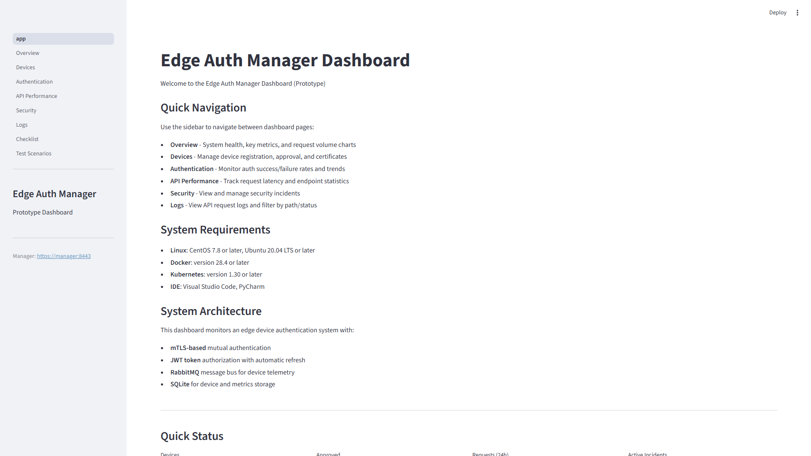 | Dashboard Home (시스템 개요) |
| 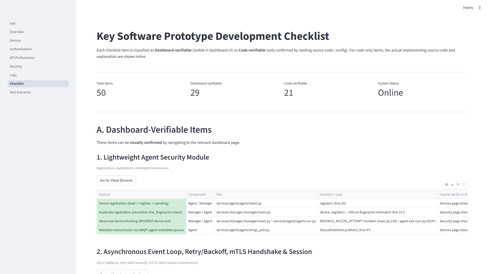 | Checklist - Dashboard Verifiable |
| 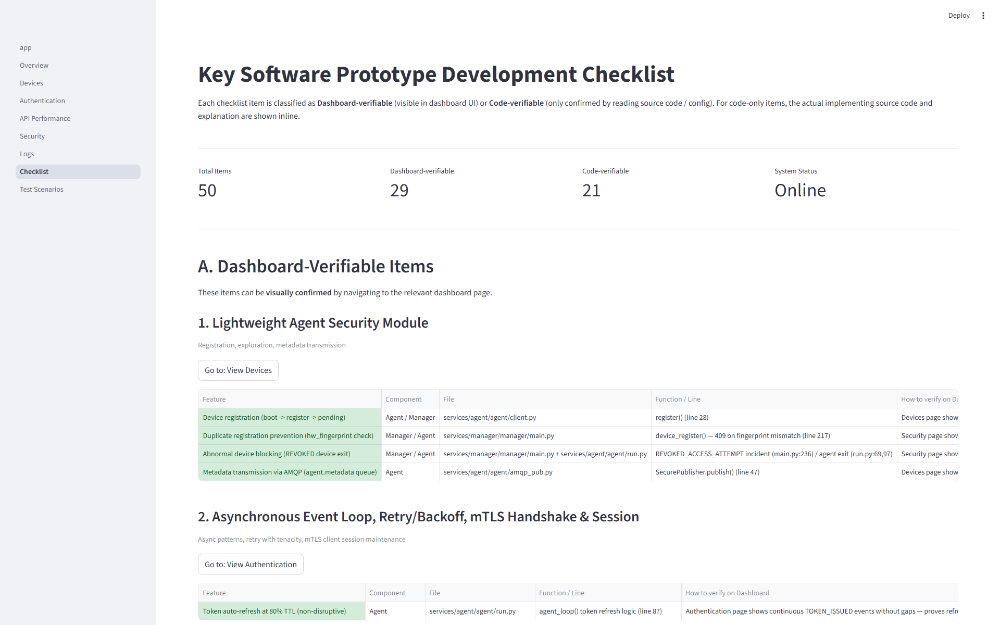 | Checklist - Code Verifiable |

#### 📋 PPT 슬라이드용 상세 설명

**42_home_page.png - 대시보드 홈 화면**
```
[슬라이드 제목] Edge Auth Manager 대시보드

[본문]
• Dashboard Home 화면:
  - Quick Status: 시스템 상태 요약
  - Quick Navigation: 주요 기능 바로가기
  - 전체 시스템 개요 제공

• 시스템 구성:
  ┌─────────────────────────────────────────────┐
  │  Docker Compose 기반 5개 서비스            │
  │  ├── Manager (Auth API)                    │
  │  ├── Agent (Security Module)               │
  │  ├── Dashboard (Admin UI)                  │
  │  ├── RabbitMQ (Message Bus)                │
  │  └── SQLite (Database)                     │
  └─────────────────────────────────────────────┘

• 단일 명령어로 전체 시스템 구동: docker compose up
```

**43_checklist_dashboard.png - 대시보드 검증 항목**
```
[슬라이드 제목] 구현 완료 검증 - Dashboard Verifiable

[본문]
• Dashboard-Verifiable Items:
  - 대시보드 UI에서 직접 확인 가능한 항목들
  - 클릭으로 실시간 검증 가능

• 검증 가능 항목 예시:
  ┌─────────────────────────────────────────────┐
  │  ✓ 디바이스 네임스페이스 형식 확인         │
  │  ✓ 상태전이 (PENDING→APPROVED) 확인        │
  │  ✓ mTLS Enforced 상태 확인                 │
  │  ✓ JWT TTL 설정 확인                       │
  │  ✓ RBAC 권한 매트릭스 확인                 │
  │  ✓ RabbitMQ TLS 연결 확인                  │
  └─────────────────────────────────────────────┘

• 외부 감사(Audit) 시 실시간 검증 가능
```

**44_checklist_code.png - 코드 검증 항목**
```
[슬라이드 제목] 구현 완료 검증 - Code Verifiable

[본문]
• Code-Verifiable Items:
  - 소스 코드에서 확인해야 하는 항목들
  - 코드 스니펫과 파일 경로 제공

• 검증 가능 항목 예시:
  ┌─────────────────────────────────────────────┐
  │  ✓ Non-root 컨테이너 설정                  │
  │    → Dockerfile: USER manager (UID 1001)   │
  │  ✓ 재시도/백오프 구현                      │
  │    → client.py: @retry(stop=5, wait=exp)   │
  │  ✓ 로컬 버퍼 구현                          │
  │    → buffer.py: JsonlBuffer class          │
  │  ✓ 토큰 자동 갱신                          │
  │    → run.py: TTL 80% 시점 갱신             │
  └─────────────────────────────────────────────┘

• 61개 체크리스트 항목 100% 구현 완료
```

**발표 포인트:**
- Non-root 컨테이너 (manager:1001, agent:1002, dashboard:1003)
- TLS 강제, guest 계정 제거
- 최소권한 Role (RabbitMQ 정규식 제한)

---

## 3. 테스트 시스템

| 스크린샷 | 설명 |
|----------|------|
|  | Current Cycle (현재 테스트 결과) |
| 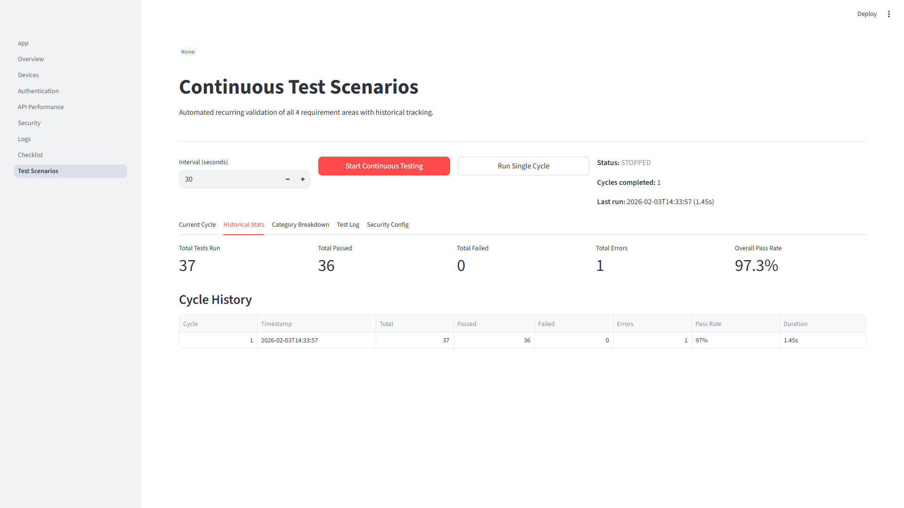 | Historical Stats (추세 차트) |
| 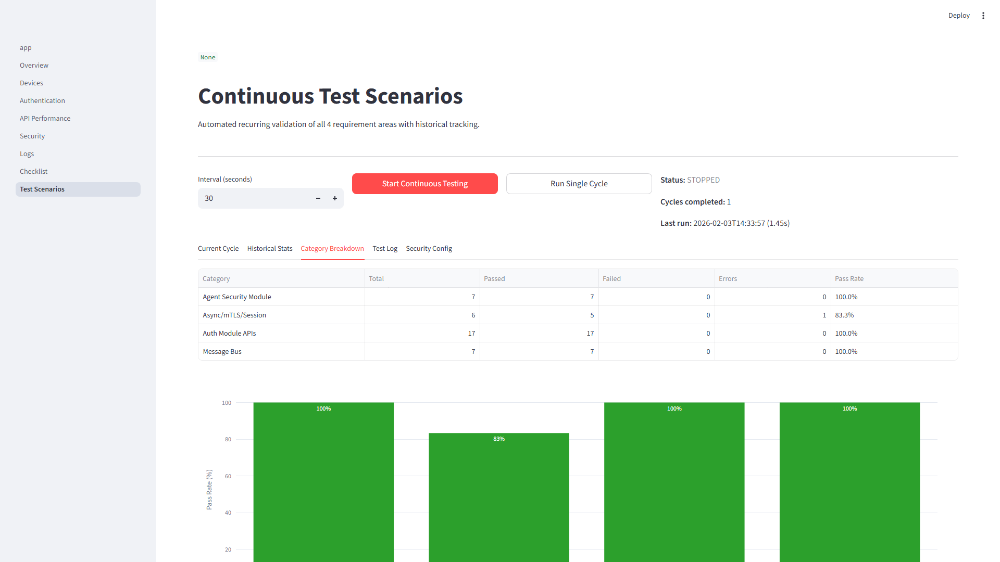 | Category Breakdown (카테고리별) |
| 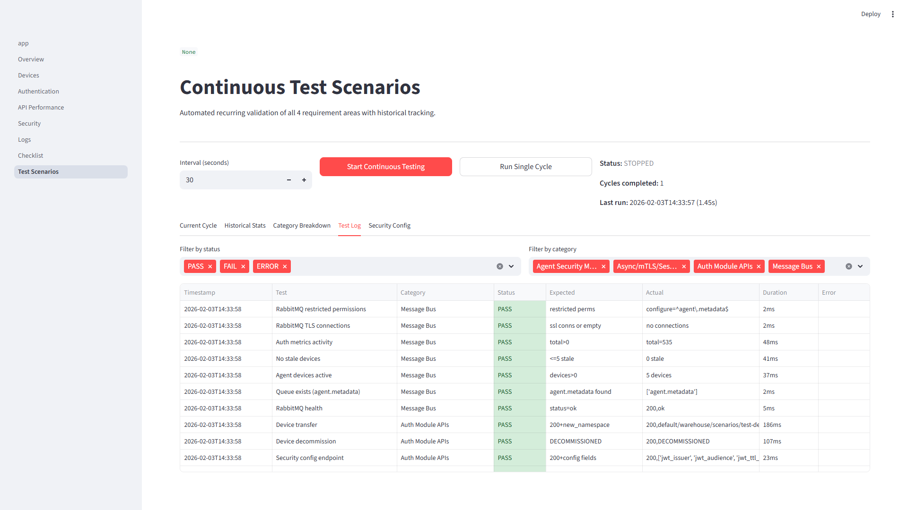 | Test Log (테스트 로그) |

#### 📋 PPT 슬라이드용 상세 설명

**45_test_current_cycle.png - 현재 테스트 사이클**
```
[슬라이드 제목] 자동화 테스트 시스템 - 현재 사이클

[본문]
• Current Cycle 탭:
  - Total Tests: 전체 테스트 수
  - Passed: 통과한 테스트 수 (녹색)
  - Failed: 실패한 테스트 수 (빨간색)
  - Pass Rate: 성공률 (%)

• 테스트 카테고리 (4개, ~25개 테스트):
  ┌─────────────────────────────────────────────┐
  │  1. Agent Security Module (디바이스 등록)  │
  │  2. Async/mTLS/Session (상호 인증)         │
  │  3. Auth Module APIs (인증/인가)           │
  │  4. Message Bus (메시지 버스)              │
  └─────────────────────────────────────────────┘

• 30초 주기로 자동 실행, 실시간 결과 업데이트
```

**46_test_historical.png - 테스트 이력 통계**
```
[슬라이드 제목] 테스트 추세 분석 - Historical Stats

[본문]
• Historical Stats 탭:
  - 시간별 성공률 추세 차트
  - 누적 테스트 통계
  - 최대 100 사이클 이력 보관

• 추세 분석 활용:
  ┌─────────────────────────────────────────────┐
  │  시간                                      │
  │  ↓                                         │
  │  ━━━━━━━━━━━━━━━━━━━━━ 100% 성공률         │
  │         ↘                                  │
  │           ━━━━━━ 일시적 하락 (조사 필요)   │
  │                   ↗                        │
  │  ━━━━━━━━━━━━━━━━━━━━━ 복구               │
  └─────────────────────────────────────────────┘

• 시스템 안정성 지속 모니터링
```

**47_test_category.png - 카테고리별 분석**
```
[슬라이드 제목] 카테고리별 테스트 현황 - Category Breakdown

[본문]
• Category Breakdown 탭:
  - 4개 카테고리별 성공률 바 차트
  - 카테고리별 테스트 수/통과 수

• 카테고리별 상세:
  ┌─────────────────────┬────────┬──────────────┐
  │  Category           │  Tests │  Pass Rate   │
  ├─────────────────────┼────────┼──────────────┤
  │  Agent Security     │  5     │  100%        │
  │  Async/mTLS/Session │  5     │  100%        │
  │  Auth Module APIs   │  11    │  100%        │
  │  Message Bus        │  6     │  100%        │
  └─────────────────────┴────────┴──────────────┘

• 취약 카테고리 식별 및 집중 개선 가능
```

**48_test_log.png - 테스트 로그**
```
[슬라이드 제목] 테스트 실행 로그 - Test Log

[본문]
• Test Log 탭:
  - 최근 테스트 결과 상세 로그
  - 필터링: 상태별, 카테고리별
  - 최대 100개 항목 보관

• 로그 필드:
  ┌─────────────────────────────────────────────┐
  │  Timestamp: 테스트 실행 시각               │
  │  Test Name: 테스트 이름                    │
  │  Category: 테스트 카테고리                 │
  │  Status: PASS/FAIL/ERROR                   │
  │  Duration: 소요 시간 (ms)                  │
  │  Expected: 예상 결과                       │
  │  Actual: 실제 결과                         │
  └─────────────────────────────────────────────┘

• 실패 테스트 상세 분석 및 디버깅 지원
```

---

## PPT 슬라이드 구성 제안

| 슬라이드 | 제목 | 사용할 스크린샷 |
|----------|------|----------------|
| 1 | 표지 | - |
| 2 | 시스템 개요 | 42_home_page, 20_overview_metrics |
| 3 | 디바이스 네임스페이스 | 01_namespace_device_list |
| 4 | 상태전이 및 관리 | 02_status_pending, 05_admin_actions |
| 5 | 네트워크 분리/QoS | 50_checklist_network_code, 51_checklist_container_code |
| 6 | mTLS 정책 | 10_jwt_security_status, 52_checklist_mtls_code |
| 7 | RBAC 권한 매트릭스 | 13_rbac_matrix, 15_test_rbac |
| 8 | 인증서/키 관리 | 16_crl_section, 17_cert_status, 19_security_config |
| 9 | 3계층 아키텍처 | 07_network_overview, 20_overview_metrics, 21_rabbitmq_queues |
| 10 | 인증 흐름 | 24_test_agent_security, 25_auth_events_timeline |
| 11 | 관찰성 | 27_logs_page, 29_system_health |
| 12 | 에이전트 모듈 | 30_device_registration, 32_test_registration |
| 13 | 인증 API | 33_cert_actions, 35_test_auth_apis |
| 14 | 메시지버스 | 37_rabbitmq_tls, 39_test_rmq_health |
| 15 | 컨테이너/보안 | 43_checklist_dashboard, 44_checklist_code |
| 16 | 테스트 시스템 | 45_test_current_cycle, 46_test_historical |
| 17 | 요약 | - (61개 항목 100% 구현 완료) |

---

## 스크린샷 파일 목록 (54개)

```
01_namespace_device_list.png
02_status_pending.png
05_admin_actions.png
07_network_overview.png
08_test_mtls.png
10_jwt_security_status.png
11_auth_summary.png
12_token_events.png
13_rbac_matrix.png
14_hmac_algorithm.png
15_test_rbac.png
16_crl_section.png
17_cert_status.png
18_last_rotation.png
19_security_config.png
20_overview_metrics.png
21_rabbitmq_queues.png
22_rabbitmq_overview.png
23_test_messagebus.png
24_test_agent_security.png
25_auth_events_timeline.png
26_security_incidents.png
27_logs_page.png
28_logs_filter.png
29_system_health.png
30_device_registration.png
31_device_lastseen.png
32_test_registration.png
33_cert_actions.png
35_test_auth_apis.png
36_auth_failure_analysis.png
37_rabbitmq_tls.png
38_queue_metadata.png
39_test_rmq_health.png
40_test_rmq_permissions.png
42_home_page.png
43_checklist_dashboard.png
44_checklist_code.png
45_test_current_cycle.png
46_test_historical.png
47_test_category.png
48_test_log.png
50_checklist_network_code.png
51_checklist_container_code.png
52_checklist_mtls_code.png
53_intermediate_ca_code.png
54_crl_ocsp_section.png
55_agent_async_code.png
56_gateway_rabbitmq.png
57_manager_overview.png
58_register_retry_code.png
59_jwt_token_code.png
60_buffer_reconnect_code.png
61_full_auth_flow_code.png
```

---

## 발표 요약 슬라이드용 내용

### 마지막 슬라이드 - 프로젝트 요약
```
[슬라이드 제목] Edge Auth Manager 프로토타입 - 구현 완료 요약

[본문]
• 구현 완료 현황:
  ┌─────────────────────────────────────────────┐
  │  총 61개 체크리스트 항목                   │
  │  ✓ Dashboard-Verifiable: 31개 (100%)       │
  │  ✓ Code-Verifiable: 30개 (100%)            │
  │  → 전체 구현 완료율: 100%                  │
  └─────────────────────────────────────────────┘

• 핵심 구현 사항:
  1. 요구사항 정의 및 정책 설계 (8개 항목) ✓
     - 네임스페이스, mTLS, RBAC, PKI, 3계층 아키텍처

  2. 핵심 소프트웨어 프로토타입 개발 (4개 모듈) ✓
     - Agent 보안 모듈, 인증 API, 메시지버스, 컨테이너

• 보안 특징:
  - 모든 통신 구간 TLS 암호화
  - 상호 인증 (mTLS) 필수
  - RBAC 최소 권한 원칙 적용
  - Non-root 컨테이너 실행

• 운영 특징:
  - 자동화 테스트 시스템 (30초 주기)
  - 실시간 모니터링 대시보드
  - 구조화 로그 및 메트릭스
```

---

## 발표 팁

1. **데모 준비**: 발표 전 `docker compose up -d`로 시스템 실행
2. **실시간 데모**: 가능하면 스크린샷 대신 실제 대시보드 시연
3. **테스트 실행**: Test Scenarios 페이지에서 "Start" 버튼 클릭하여 테스트 실행 모습 시연
4. **RabbitMQ 로그인**: http://localhost:15672 (ID: isl / PW: wjdqhqhghdusrntlf1!)
5. **강조 포인트**: 보안 (mTLS, RBAC), 자동화 (테스트), 관찰성 (로그, 메트릭스)
